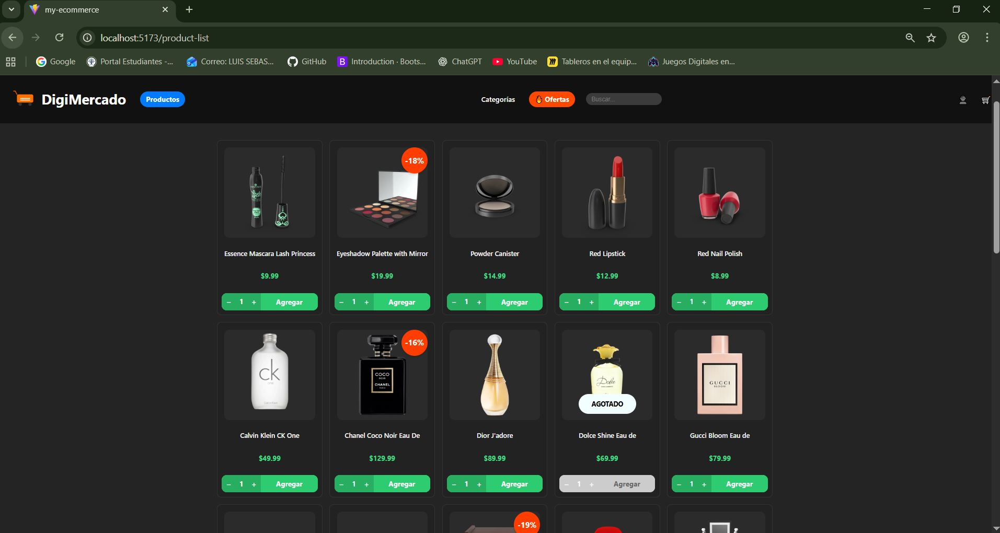
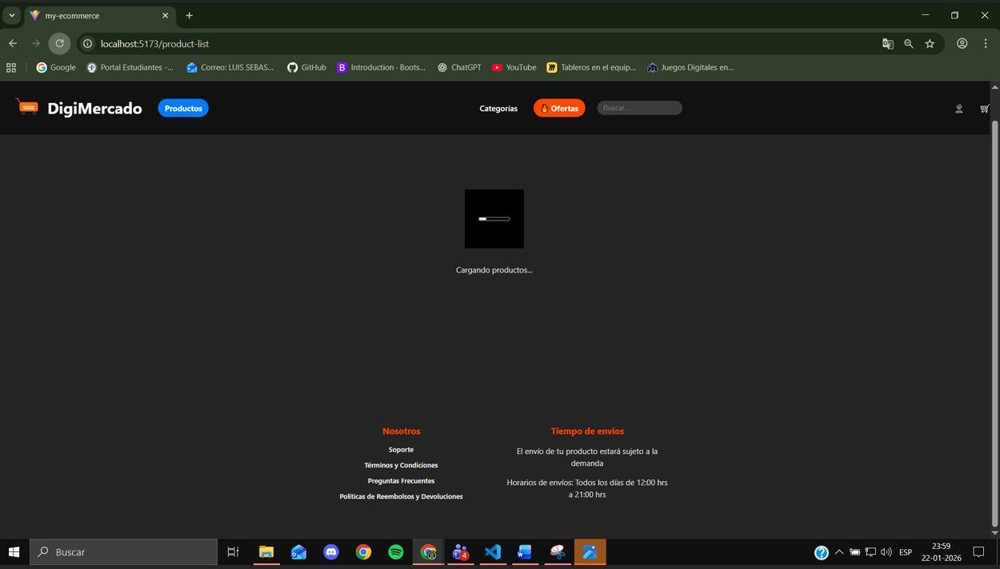

# Proyecto Modulo 2: "Ecommerce DigiMercado"

Descripción: Venta de mercado online

Componentes creados:

- Card /Contiene la logica de cada card.
- Buttons: ButtonCard, ButtonFooter, NavbarButton /Logica dependiendo de cada boton para darle sus estilos dependiendo del boton en el css.
- Footer /Contiene la logica para el footer con sus estilos.
- ImageStatus /Contiene el estilo de la imagen y logica para usar el isSale y isSoldout.
- Navbar: Navbar, Dropdown, DropdownItem, NavbarBrand, SearchBar /Contiene la logica para el Navbar, junto con sus estilos.
- Logo /Logica para el logo.
- ProductGrid /Contenedor que organiza y muestra la lista de productos.
- ProductTitle /Logica y estilo para titulo de cada Card.
- ProductPrice /Logica y estilo para precio de cada Card.
- ProductState /Maneja los estadosde carga, error y ausencia de datos para la lista de productos (Loader con gif/ErrorMessage)

Api y Route:

- Services: productService.js para llamar a la api y traer los productos.
- Route: Use route dentro del NavbarBrand "DigiMercado" para ir a la pagina raiz "/".
- Route: Use route en el boton del Navbar "Productos" para ir a la pagina "/product-list"

Filtros creados:

- Por oferta
- Por busqueda
- Por categoria

Pasos para ejecutar proyecto:

1. Clonar desde repositorio.
   En terminal: git clone https://github.com/Luisordenes/My-ecommerce.git

2. Entrar a la carpeta del proyecto.
   En terminal: cd My-ecommerce

3. Instalar dependencias.
   En terminal: npm install

4. Ejecutar proyecto. 
   En terminal: npm run dev

# React + Vite

Principal

Captura Error

Productos

Filtro Categoria

Filtro Ofertas

Filtro Busqueda

Mensaje filtro busqueda

Cards con botones y aplicacion de isSale y isSoldOut

Loading

